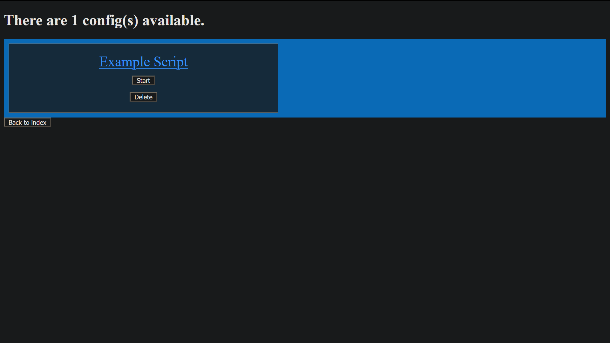

# wsb-stock-miner

Developed by Nick and Adrian

Features:
 - Allows user to create a config for a subreddit with custom keywords, sends results via Discord webhook (you must set this up yourself)
  - If you want periodic updates, run this in a cronjob, as this only runs once.
 - User can create and run multiple scripts at a time, thanks to Python subprocess
 

